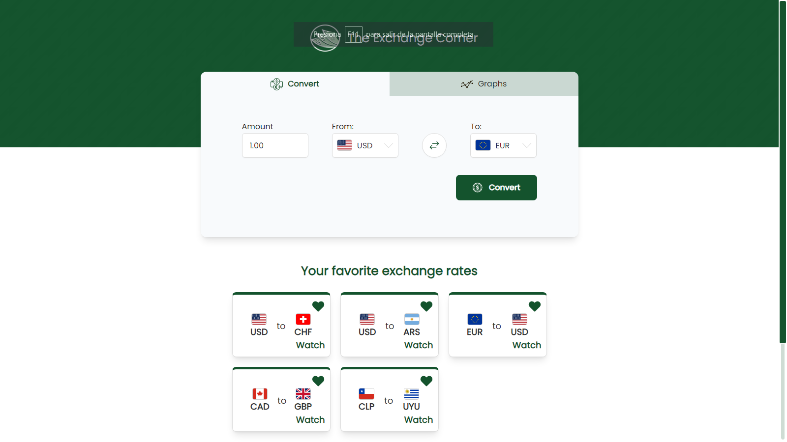
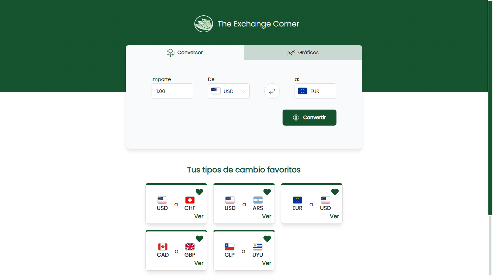

  

---

# The Exchange Corner

The Exchange Corner is a web application that provides currency conversion and obtaining historical exchange rates. Users can make currency conversions, explore historical exchange rates, and add their favorite currency pairs. Additionally, the app enhances the user experience with informative sections, such as one that shows the most common conversions for the selected base currency. All this within an accessible, simple and harmonious interface.

You can <a href="https://www.youtube.com/watch?v=CRLlMPW1qUM" target="_blank">**click here**</a> to see an overview the app in action.

## Features

- Performs currency conversions quickly and accurately.
- Retrieves real-time exchange rates for a wide variety of currencies.
- Accesses historical exchange rates for analysis and tracking.
- Adds conversions to a favorites system for quick and convenient access.
- Explores the most common currencies associated with the currency you are searching for.
- Enjoys a simple and harmonious interface for a pleasant user experience.
- Granular and user-friendly error handling through the ErrorBoundary component.
- Implementation of internationalization with next-intl, offering users the option to view content in Spanish or English.
- Utilizes a toast system to notify the user of the outcomes of various actions and enhance their experience in the application.
- Implementation of a streaming system when fetching data, leveraging the features of Next.js.
- Access and updates data granularly, improving the efficiency and speed of the application.
- Provides a smooth user experience when dynamically loading information.
- Enhanced user experience during data loading thanks to the implementation of skeleton components.

## Technologies Used

- <a href="https://react.dev/" target="_blank">**React**</a>: A JavaScript library for building interactive user interfaces.
- <a href="https://next-intl-docs.vercel.app/docs/getting-started" target="_blank">**Next.js**</a>: A React framework that enables server-side rendering, automatic code splitting, and simplified routing for building powerful and efficient web applications.
- <a href="https://www.typescriptlang.org/docs/" target="_blank">**TypeScript**</a>: A superset of JavaScript that adds static types and other features to the language syntax.
- <a href="https://www.npmjs.com/package/dotenv" target="_blank">**Dotenv**</a>: A zero-dependency module for loading environment variables.
- <a href="https://axios-http.com/" target="_blank">**Axios**</a>: A popular library for making HTTP requests.
- <a href="https://tailwindcss.com/" target="_blank">**Tailwind CSS**</a>: A utility-first CSS framework that simplifies styling by providing low-level utility classes, enabling a straightforward and fast approach to building modern and responsive interfaces.
- <a href="https://next-intl-docs.vercel.app/" target="_blank">next-intl</a>: A Next.js library for internationalization (i18n) that facilitates easy management of translations and localization in your application. 
- <a href="https://www.alphavantage.co/" target="_blank">AlphaVantage</a>: AlphaVantage API is a financial data provider that offers a wide range of data, such as currency conversion and historical rates.

## Project Structure

- `public`: Contains static assets such as images and icons used in the application.
- `public/locales`: Contains json files used in internationalization.
- `src/app`: Contains the main files and pages of the application.
- `src/components`: Contains reusable components used in different parts of the application.
- `src/context`: Contains context providers and consumers used for state management.
- `src/models`: Contains TypeScript interfaces, models or types used for defining data structures.
- `src/services`: Contains Axios instances, interceptors, and calls to the AlphaVantage API to perform currency conversions and obtain historical data.
- `src/utilities`: Contains utilities and helper functions used in the application.

## Authors

- Matías Gonta

If you have any questions, concerns or interest, feel free to contact me.

---

  

---

# The Exchange Corner

The Exchange Corner es una aplicación web que proporciona la conversión de divisas y la obtención de tasas de cambio históricas. Los usuarios pueden realizar conversiones de divisas, explorar tipos de cambio históricos y agregar sus pares de divisas favoritos. Además, la aplicación mejora la experiencia del usuario con secciones informativas, como una que muestra las conversiones más comunes para la moneda base seleccionada. Todo esto dentro de una interfaz accesible, simple y armoniosa.

Puedes hacer <a href="https://www.youtube.com/watch?v=CRLlMPW1qUM" target="_blank">**click aquí**</a> para ver una visión general de la aplicación en acción.

## Características

- Realiza conversiones de monedas de manera rápida y precisa.
- Obtiene tasas de cambio en tiempo real para una amplia variedad de monedas.
- Accede a tasas de cambio históricas para realizar análisis y seguimiento.
- Agrega conversiones a un sistema de favoritos para un acceso rápido y conveniente.
- Explora las divisas más comunes asociadas a la divisa que estás buscando.
- Disfruta de una interfaz simple y armoniosa para una experiencia de usuario agradable.
- Manejo granular y amigable de errores a traves del componente ErrorBoundary.
- Implementación de internacionalización con next-intl, ofreciendo a los usuarios la opción de visualizar el contenido en español o inglés.
- Utiliza un sistema de toast para notificar al usuario sobre el resultado de distintas acciones y mejorar su experiencia en la aplicación.
- Implementación de sistema de streaming a la hora de hacer fetching de datos, aprovechando las características de Next.js.
- Accede y actualiza datos de manera granular, mejorando la eficiencia y la velocidad de la aplicación.
- Proporciona una experiencia de usuario fluida al cargar información de manera dinámica.
- Experiencia de usuario durante la carga de datos mejorada gracias a la implementación de componentes esqueletos.

## Tecnologías utilizadas

- <a href="https://react.dev/" target="_blank">**React**</a>: Una biblioteca de JavaScript para crear interfaces de usuario interactivas.
- <a href="https://next-intl-docs.vercel.app/docs/getting-started" target="_blank">**Next.js**</a>: Un framework de React que permite la representación del lado del servidor, la división automática de código y el enrutamiento simplificado para crear aplicaciones web potentes y eficientes.
- <a href="https://www.typescriptlang.org/docs/" target="_blank">**TypeScript**</a>: Un superconjunto de JavaScript que agrega tipos estáticos y otras funciones a la sintaxis del lenguaje.
- <a href="https://www.npmjs.com/package/dotenv" target="_blank">**Dotenv**</a>: Un módulo sin dependencias para cargar variables de entorno.
- <a href="https://axios-http.com/" target="_blank">**Axios**</a>: Una biblioteca popular para realizar solicitudes HTTP.
- <a href="https://tailwindcss.com/" target="_blank">**Tailwind CSS**</a>: Un framework de CSS centrado en las utilidades, que simplifica el estilo al proporcionar clases de utilidades de bajo nivel, lo que permite un enfoque sencillo y rápido para crear interfaces modernas y responsivas.
- <a href="https://next-intl-docs.vercel.app/" target="_blank">Next-intl</a>: Una biblioteca Next.js para internacionalización (i18n) que facilita la gestión de traducciones y localización en su aplicación.
- <a href="https://www.alphavantage.co/" target="_blank">AlphaVantage</a>: AlphaVantage API es un proveedor de datos financieros que ofrece una amplia gama de datos, como conversión de divisas y tasas históricas.

## Estructura del proyecto

- `public`: Contiene imágenes e iconos utilizados en la aplicación.
- `public/locales`: Contiene archivos json utilizados en la internacionalización.
- `src/app`: Contiene los archivos principales y páginas de la aplicación.
- `src/components`: Contiene componentes reutilizables utilizados en diferentes partes de la aplicación.
- `src/context`: Contiene proveedores de contexto y consumidores utilizados para la gestión del estado.
- `src/models`: Contiene interfaces, modelos o tipos de TypeScript utilizados para definir estructuras de datos.
- `src/services`: Contiene las instancias, interceptores y llamadas Axios a la API AlphaVantage para realizar conversiones de monedas y obtener datos históricos.
- `src/utilities`: Contiene utilidades y funciones auxiliares utilizadas en la aplicación.

## Autores

- Matías Gonta

Si tiene alguna pregunta, inquietud o interés, no dude en ponerse en contacto conmigo.